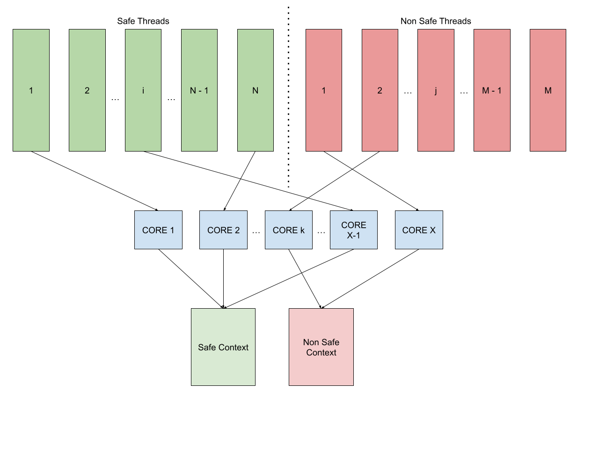
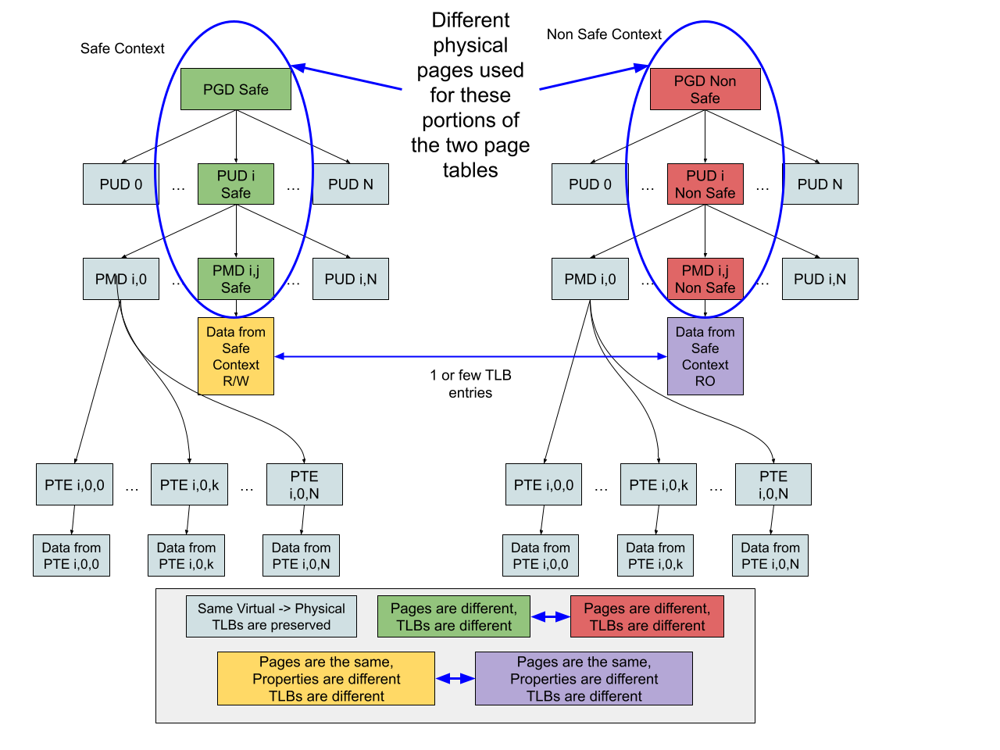

# NOTE: 

**Previous material relevant to this topic:**

- [Safety in processes CPU execution state](https://linuxplumbersconf.org/event/7/contributions/698/): focused on the integrity of the CPU execution state.  
Mainly focused on problem c. above. This session also mentions HW faults (that are out of scope WRT to our investigation). About SW Faults (slide10):
    - Data corruption was skipped
    - Task switching: how the process state is saved and restored
    - Bad Kernel Code: TBD?
- Codethink Mitigations:
    - Shadowing the Thread Control Block (is it [https://git.kernel.org/pub/scm/linux/kernel/git/stable/linux.git/tree/include/linux/sched.h) ?)
    - Wrapping syscall and other entry points 

    - [https://www.codethink.co.uk/articles/2020/investigating-kernel-user-space-access/](https://www.codethink.co.uk/articles/2020/investigating-kernel-user-space-access/):  
    - Focuses on mechanisms preventing corruption of user space process address spaces from kernel threads. This is in scope of point a. and c. above.
    It considers both static and runtime features.
    From a runtime point of view the considered features are:

        - [Kernel Self Protection](https://www.kernel.org/doc/html/latest/security/self-protection.html)
        - [Supervisor Mode Execution Prevention](https://en.wikipedia.org/wiki/Control_register#SMEP) (SMEP)
        - [Supervisor Mode Access Prevention](https://en.wikipedia.org/wiki/Supervisor_Mode_Access_Prevention) (SMAP). 

**Safe Process Context Protection:** Prevent the silent corruption of a safe process context.

**Preamble:**

A process can either be limited to kernel space (ex: kernel thread) or (typical case) consist of a user-space execution flow, which from time to time pivots into kernel space, for executing system calls.

Such system calls can also involve other kernel components, for example device drivers and kernel frameworks, like those used for memory management. When a user-space process transitions into kernel mode, during a system call, it relies on a kernel call stack, which is associated with it and contains the temporary state, while the kernel enters and exits various function calls..

In reality, a user-space application can have multiple execution threads:

* they will share one common address space, when in user-mode
* Each thread will have its own call stack, when in kernel mode, because they can be executed in parallel, on different cores, and thus need separate stacks.

For simplicity, it’s possible to consider a single-thread application, though.

The context of a process is comprised, therefore, of:
* “Direct” context:
    * the userspace mappings (one, even in case of multi-threaded process)
    * The kernel space call stack (in case of multi-thread process, there would be as many as the threads)
* “Indirect” context:
    * The memory used/allocated/released as side effect of syscalls performed by the process
    * The memory used/allocated/released by components interacting with the process, i.e. device drivers that the process interacts with (i.e. sensors/actuators)
    * The memory used/allocated/released by components providing the “substrate” supporting the operations of the component (ex: the scheduler, the various memory managers, interrupt handling, pipes, etc.)
The “Direct” context is obviously important, however also the “Indirect” context is equally important, because it can corrupt the former in subtle ways that are hard to detect, but can equally lead to catastrophic failures. Even more so, because they are far subtler and harder to detect.
Example: use after free of a memory page, which is still used by a device driver, while in reality it had been already released and re-allocated, resulting in the silent corruption of data stored, which can be anything.

Traditionally when creating a safe OS, the way to deal with these risks of corruption is to have HW tripwires, configured to trigger on illegal/unexpected memory operations. The MMU is the HW component which, among other functionality, also implements such safeguards. And this is how it is used, mostly, for providing isolation between different userspace processes. Similarly, it also prevents said processes from directly accessing kernel space.

From a safety perspective, not all userspace processes and not all the kernel threads are equally relevant: some will be involved in safe operations that must be safeguarded, others will not have relevance from a safety perspective.

This consideration is important, because labeling something as safe will introduce heavier requirements in terms of sw lifecycle and thus increase the associated costs.

**Problem 1:**
The kernel maintains a direct map of the entire physical memory (physmap), which allows the bypassing of the regular way to do memory access. This memory plays a role in managing slabs and user-space mappings (More details needed, pending further investigation related to SL[AU]B).

**Solution:**
The solution for this problem should be fairly straightforward, by either removing the mapping of the memory pages used for content that should be protected, in a safety scenario, or at least map them as read-only, when they are not supposed to be used.
The major problem is the potential loss of performance. In that case, it might be possible to create different contexts with different mapping properties (see next point wrt linear mappings).

**Problem 2:** 
The kernel space call stacks of all the safe processes, and all the “Indirect Context” are exposed as writable to their non-safe counterparts running in kernel space.
**It would be desirable to expose the safe context, at most, as read-only, to the non-safe context.**

**Possible Solution(s):**

**A. Use HW-specific feature, like Memory Tag Extensions (MTE) / Pointer Authentication (PA) / Branch Target Identification (BTI), in the ARM case**  
Certain processors (for example ARM a8.5 and later) support at HW level the option of memory coloring, in various forms and shapes, so that when trying to access a memory area that is “the wrong color” an exception will trigger, and it can then be trapped and processed.
However, this approach, besides being limited in the amount of areas that can be defined, has also the disadvantage of depending on a very specific set of HW features, which might not be too portable. While it should not be discarded, it is likely to be more effective if used in conjunction with other strategies.

**B. Use of the MMU for dynamically altering access properties, per core**  
This option has the advantage of being possible without requiring additional HW features, however it is not straightforward, how to use it.
Given the requirement:  
“**to expose the safe context, at most, as read-only, to the non-safe context**”  
_In order to fulfill it with the mmu, safe context and non safe context must be non interleaved, within a memory page, because the MMU operates with page granularity._  

Furthermore, currently, each core shares the same set of page tables, when it comes to kernel-space mappings, but this would not be acceptable, because making some data read-only one one core (running non-safe code) would also make it read-only on another core, running safe code.  

The additional requirement is that:  
“**Safe/Non-safe need own page tables, supporting same-mapping but different-properties**”  
_Whenever either a safe or a non-safe process is executed on a certain core, it will use its corresponding page table._  

In practice this approach would define the default Linux context as safe, because it contains all those key components required for the lifecycle of a process.
Non-safe processes would instead run using a set of page tables which enforces limitations they are not supposed to hit, anyways, in a healthy execution.

**Further analysis of Solution 2.B**  
The proposed solution comes with a set of issues that should be analyzed and mitigated if needed.  
1. **Multiple page tables**  
Linus is already on record having expressed deep dislike for per-core page tables, however this approach is aimed at having per-context page tables.  
At the moment the contexts are two: safe and non-safe. Possibly, the safe context might be further split into (core & uncore), but for now just two should be sufficient.
2. **The microkernel pitfall**  
Traditionally, the approach for ensuring memory isolation between OS components is to use the microkernel architecture, where the very core of the SO runs at highest priority, and everything else is instead run in a separate partition. This is also what most commercial OSes used in safety applications do. The impact on performance is massive. The proposed solution, however, doesn’t attempt to morph Linux into a microkernel, but it rather tries to separate contexts, based on their use and level of validation. But it should (mostly) never be necessary to change page-table, while executing in a certain context. Definitely never when in a safe context, and possibly some times while in a non-safe context.  
3. **Performance**  
CPUs rely on the MMU to perform translations of virtual-to-physical addresses, and the MMU implements the conversion by walking a page table. Since walking the page table is expensive, results of most recent/used  translations are stored in a (small) cache, the TLB.  
The microkernel implementation is so dreaded because it causes the TLB to be used in a very inefficient way (compared to the monolithic approach used by Linux).  
Most of the optimizations are therefore aimed at minimizing the TLB misses that this solution will cause.  

**Considerations about MMU/TLB Performance, for Solution 2.B**

1. What needs to be protected, from safe to non safe context, is data, and 2 ways are possible, for protecting the data:
    1. _Make it invisible, by removing the mapping from the non-safe context_
    2. _Make it read-only, by changing the mapping properties_  
    Not all the data of the safe context needs to be exposed to the non-safe one, only the data which might be occasionally read.

2. The MMU (usually) supports various forms of optimization, where it is possible to avoid sub-branches of the page table, by mapping a larger chunk of physical memory. For example, on ARM a9 architecture, instead of having leaf nodes of 4KB pages, which do not need to be physically contiguous, it is possible instead to have a shorter branch, mapping directly 1MB of physically contiguous memory.
    1. While this approach is seldom possible in creating memory for a userspace process, because of the progressive fragmentation of the physical address space, it is certainly possible to use such allocations for link-time allocated data, within the kernel address space, like the .bss and .data segments. The advantage of such a strategy is that this large chunk will use up only one entry in the TLB (which could even be manually locked), rendering the impact of changing its mapping properties (and thus trashing the TLB cached value) far smaller, than changing all the 4KB leaves.  
    From this consideration, a secondary requirement emerges:  
        “**Group and align link-time allocated data to minimizes its TLB footprint**”
    2. Similar approach can be applied to memory which is managed by the slab allocator, since it is specialized in small (sub-page) allocations, and the pages backing the allocators can be divided into 2 groups, based on their use (safe/non-safe).  
    Another secondary requirement emerges:  
    “**Group and align memory for slab allocator to minimizes its TLB footprint**”
    3. For memory which is not physically contiguous, like what can be obtained from vmalloc, it is not possible to optimize the mapping with a few larger elements, so that it can be made read-only with few changes to the TLB.  
    Anyways, the mapping would be on average short lived, and would need to be maintained across two different page tables.  
    Instead, it’s simpler to _just leave it absent from the non-safe version of the page table_, since it’s related to data which the non-safe context doesn’t even need to have direct read access to.  
    In this case the additional secondary requirement is:  
    “**Reserve for virtually linear mapping an address space that is easily prunable**”  
    In other words, depending on the specific implementation of the page table, it should be possible to relegate dynamic runtime safe mapping to a range that equals to one/few upper/middle page table entries.  
3. Since other parts of the memory mappings are already write protected, either because they refer to code, or because they refer to constants, their mappings can be identical across both page tables, to optimize the utilization of the TLB.  
The corresponding requirement is:  
“**Share write-protected mappings between both safe and non-safe context**”  
4. In order to avoid thrashing of the TLB, each context should have its own local version of relevant kernel metadata, so that the non-safe context would rely on its own state, instead of frequently switching to safe context.  
The corresponding requirement is:  
“**Replicate in each context those state variables which are used exclusively within it**”
5. For more substantial operations, where the overall time spent executing the functionality is significantly longer than the delay due to the context switch, it is instead more appropriate to envision that the non-safe context would pivot to the safe context, but only for functionality which is deemed to be safe. In other words, the secondary requirement can be formulated as:  
“**The non-safe context can access only non-safe context writable; the safe context can access writable data from both the safe and the non-safe context**”  
Operations which are considered safe, but should be available to the non-safe context should have a preamble/epilogue which ensures they will run in safe context, and then will restore the entering context, if needed.
6. Because each core has its own MMU/TLB, by exploiting affinity of safe / non-safe processes with different cores, it is in practice possible to avoid changes of kernel page tables on a specific core, even when scheduling different processes.  
The ensuing requirement is:  
“**Prioritize same-context per core, when scheduling a new process**”

