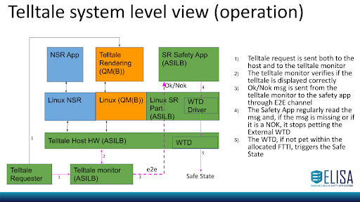

# “Revisited STPA” on the telltale use case

##### DISCLAIMER: This Analysis is inspired by STPA,  IS NOT COMPLETE and is NOT aligned with the STPA analysis of the Automotive WG. It is exclusively intended to kick-off a hierarchical STPA-like methodology for the analysis of the Kernel. 

## Phase1: “Define purpose of the Analysis”
Note: this phase is not really in the scope of the Architecture WG. Below we are briefly documenting assumptions that allow us to focus on the following phases.

### System Level Diagram

[Reference TSC used for this analysis](https://github.com/Jochen-Kall/wg-automotive/blob/master/AGL_cluster_demo_use_case/Concept.md "Reference TSC used for this analysis")

#### Identifying losses

Definition: A loss involves something of value to stakeholders. Losses may include a loss of human life or human injury, property damage, environmental pollution, loss of mission, loss of reputation, loss or leak of sensitive information, or any other loss that is unacceptable to the stakeholders.

**L-1: Loss of life or injury to people.** E.g. car accident due to a telltale not displayed on time or wrong telltale been displayed

#### Identifying system-level hazards 
Definition: A hazard is a system state or set of conditions that, together with a particular set of worst-case environmental conditions, will lead to a loss.

Definition: A system is a set of components that act together as a whole to achieve some common goal, objective, or end. A system may contain subsystems and may also be part of a larger system.

**H1: wrong telltale is displayed**

**H2: telltale not displayed on time (within 200msec from the telltale request event)**

Note:

#### Defining system-level constraints 

Definition: A system-level constraint specifies system conditions or behaviors that need to be satisfied to prevent hazards (and ultimately prevent losses)

**H1: wrong or corrupted telltale is displayed**

**SC1: The system shall transition to the safe state within 100ms of the display showing an unrequested telltale for longer than 100 ms**

&nbsp;

**H2: telltale not displayed on time (within 200msec from the telltale request event)**

**SC2: while requested, the system shall display the driver warning within 200 ms or transition to the safe state within 200 ms**

Note: as you can see above the system level constraint match the safety goals defined in the [safety concept](https://github.com/Jochen-Kall/wg-automotive/blob/master/AGL_cluster_demo_use_case/Concept.md) 

## Phase2: “Modeling the control structure” 

Definition: A hierarchical control structure is a system model that is composed of feedback control loops. An effective control structure will enforce constraints on the behavior of the overall system.

The diagram below is inspired by a top down STPA hierarchical control structure, however it deviates from it.

Semantically the result is equivalent however there are some key differences:
- Some elements can be both controllers or controlled processes depending on the use case. E.g. “Host HW” can be a controller when initiating control actions (like interrupts) or a controlled process when responding to a control action (like a register write from “Linux”)
- Since the top-down hierarchy is not respected in order to disambiguate which feedback correspond to which control actions, if a control action expects a feedback, this one shall be drawn next to such control action on the right (e.g. f2 next to CA5a on the right)

Note:
* Gray boxes represent HW and SW outside our system
* White boxes represent SW within our system
* Red CAs and feedbacks are coupled

Control actions:

AoU1- Missing CA from Application to Host HW 

Rationale: it is assumed that application processes (both safety related and not safety related ones) cannot access directly to hardware elements (e.g. direct memory access through, or modifications of peripherals..). The access to hardware elements shall be managed by Linux Kernel.

AoU2 - Telltale Requester in the external context

Rationale: it is assumed that the telltale requester is outside from the system under analysis and communicate through the ethernet interface

CA1 represents "correct telltale request msg" to “Telltale monitor” and “Host HW”

CA2 represents the displayed telltale

CA3 Ok/Nok signal produced, encapsulated using E2E and sent over ethernet

CA4 represents the request to reboot the system

CA5a represents actions (syscall) requested by NSR processes in NSR App, 

CA5b represents actions (syscall) requested by processes in Telltale Rendering App

CA5c represents actions (syscall) requested by safety related processes in the Safety App

CA6 represents actions that Linux performs on the processes (schedule, block etc)

CA7 performs actions like memory, data structures and driver handling

CA8 refresh the WTD

CA9 represents the interrupt/event sent from Host HW to Linux

&nbsp;

Note:

The ok/nok signal is propagated from the Telltale monitor to the Safety app by following the path CA3, CA9, [CA7,  f1,] CA6 

&nbsp;

Feedbacks:

f1 represents the feedback related to CA7

f2 represent feedbacks related to CA5

### Table of Controllers responsibilities and associated control actions and feedbacks
The table below defines the controllers’ responsibilities according to the input CAs and also defines the expected CAs or feedbacks.

**Note:** the table is incomplete given that the main goal is to have sufficient material to initiate an analysis iteration inside the Kernel

| Input CA | Controller of the output CA | Responsibilities | Output CA or Feedback | System Constraints |
|---|---|---|---|---|
| None | Telltale Requester | every 200 msec shall send the correct telltale request msg to “Host HW” and to “Telltale Monitor” | CA1 represent "correct telltale request msg" to “Telltale monitor” and “Host HW” | SC1, SC2 |
| CA6 represent actions that Linux performs on the processes (schedule, block etc): Linux wake up the blocking read of the Telltale rendering | Telltale Rendering | shall read the telltale requester status every 200 msec and execute the rendering algorithm| CA5b TBD syscalls required to render | SC2 |
| CA1 represent "correct telltale request msg" to “Telltale monitor” and “Host HW” | Host HW | Host HW shall provide the "correct telltale request msg” to Linux | CA9 represent the interrupt/event sent from Host HW to Linux: Message received | SC1, SC2|
| CA9 represent the interrupt/event sent from Host HW to Linux: Message received| Linux | Linux shall provide the "correct telltale request msg” to Telltale rendering | CA6 represent actions that Linux performs on the processes (schedule, block etc): Linux wake up the blocking read of the Telltale rendering | SC1, SC2|
| CA5b TBD syscalls required to render | Linux | Shall process the rendering syscalls and drive the rendering process on the HW accordingly| - CA7 TBD HW specific operation for rendering the telltale 
&nbsp;
 - f2 represent TBD feedbacks related to CA5b | SC2 |
| CA7 TBD HW specific operation for rendering the telltale | Host HW | Shall render the telltale according to the drivers command from Linux | - CA2 represents the displayed telltale 
&nbsp;
 - f1 represent TBD feedbacks related to CA7 | SC2 |
| CA1 represent "correct telltale request msg" to “Telltale monitor” and “Host HW” 
&nbsp;
 CA2 represents the displayed telltale | Telltale Monitor | Every 200 msec shall read the displayed telltale from “Controlled Process - Host HW” and compare it against the msg from “Telltale Requester”. A Nok msg shall be sent if:   - No telltale has been displayed    - A wrong or corrupted telltale has been displayed    An Ok msg shall be sent if the displayed telltale matches the requested one | CA3 Ok/Nok signal produced, encapsulated using E2E and sent over ethernet | SC1, SC2 |
| CA3 Ok/Nok signal produced, encapsulated using E2E and sent over ethernet | Host HW | Shall generate a package received interrupt every time a package is received | CA9 represent the interrupt/event sent from Host HW to Linux: Message received | SC1, SC2 |
| CA9 represent the interrupt/event sent from Host HW to Linux: Ethernet Controller IRQ | Linux | Execute the ISR associated to the IRQ or Exception: Ethernet Driver ISR | CA6 represent actions that Linux performs on the processes (schedule, block etc). Linux wake up the blocking read of the Safety App | SC1, SC2 |
| CA9 represent the interrupt/event sent from Host HW to Linux: Timer Interrupt | Linux | Execute the ISR associated to the IRQ or Exception: Scheduler ISR | CA6 represent actions that Linux performs on the processes (schedule, block etc): Scheduling of a process | SC1, SC2 |
| CA6 represent actions that Linux performs on the processes (schedule, block etc): Scheduling of a process | Safety App | Shall setup an external WTD to trigger after 200msec | CA5c represent actions (syscall) requested by processes (NSR App, Telltale Rendering, Safety App):syscalls required to setup the Watchdog; open() | SC1, SC2 |
| CA6 represent actions that Linux performs on the processes (schedule, block etc): Scheduling of a process 
&nbsp;
 f2 represent feedbacks related to CA5c: open returns success | Safety App | Shall setup an external WTD to trigger after 200msec | CA5c represent actions (syscall) requested by processes (NSR App, Telltale Rendering, Safety App):syscalls required to setup the Watchdog; ioctl() | SC1, SC2 |
| CA5c represent actions (syscall) requested by processes (NSR App, Telltale Rendering, Safety App):syscalls required to setup the Watchdog;open() | Linux | Linux shall reserve the WTD resource for exclusive use of “Safety App” | CA7 performs actions like memory, data structures and driver handling: setup the file descriptor for the watchdog associated to the safety app and the associated permissions | SC1, SC2 |
| CA5c represent actions (syscall) requested by processes (NSR App, Telltale Rendering, Safety App):syscalls required to setup the Watchdog;ioctl() | Linux | Linux shall setup the WTD timeout according to the input parameter from the Safety App | CA7 performs actions like memory, data structures and driver handling: program the WTD according to the timeout from the Safety App | SC1, SC2 |
| CA5c represent actions (syscall) requested by processes (NSR App, Telltale Rendering, Safety App):syscalls required to setup the Watchdog;ioctl() | Linux | Linux shall start the WTD after the timeout from the Safety App has been setup | CA7 performs actions like memory, data structures and driver handling: start the WTD device associated to the Safety App | SC1, SC2 |
| CA6 represent actions that Linux performs on the processes (schedule, block etc): Scheduling of a process 
&nbsp;
 f2 represent feedbacks related to CA5c: ioctl() returns success| Safety App | Safety App shall read the Ok/NOk message from the Telltale Monitor every 200 msec | CA5c represent actions (syscall) requested by processes (NSR App, Telltale Rendering, Safety App): Safety App perform a blocking reads for the packet | SC1, SC2 |
| CA6 represents actions that Linux performs on the processes (schedule, block etc). Linux wake up the blocking read of the Safety App | Safety App | Safety App shall decode the Ok/NOk message: if the message integrity check is fine and the content is ‘OK’, it shall pet the watchdog | CA5c represent actions (syscall) requested by processes (NSR App, Telltale Rendering, Safety App): Safety App pets the watchdog (write the wtd) | SC1, SC2 |
| CA5c represents actions (syscall) requested by safety related processes in the Safety App: Safety App pets the watchdog (write the wtd) | Linux | Linux shall refresh the WTD upon request by the Safety App | CA8 refresh the WTD| SC1, SC2 |
| None (expired WDT) | Host HW | Host HW shall force the reboot of the system | CA4 represents the request to reboot the system| SC1, SC2 |
| None | Linux | Linux startup operations: init | CA7 performs actions like memory, data structures and driver handling | SC1, SC2 |
|   |   |   |   |  |
| TBD | NSR App | TBD | TBD | TBD |

### Phase3: “Identifying Unsafe Control Actions” 
**Disclaimer: this is an incomplete Phase3 intended to kick-off the analysis inside the Kernel.**

“Definition: 
An Unsafe Control Action (UCA) is a control action that, in a particular context and worst-case environment, will lead to a hazard”

Notation: 
- Unsafe control actions are identified by mean of the same ID of control actions prefixed by the ‘U’ character: e.g. the ID of unsafe CA6 would be “UCA6”.
- Unsafe control actions descriptions follow the following format:

`ID - <source controller> , <unsafe action>, <context information>, <[hazard description]>, <[hazard ID]>`

E.g.:

`<UCA7.1> - <Linux> <misses to set the watchdog timeout> hence <the WTD could stay set to a previously programmed timeout shorter than the one required by the safety app> and <[the wtd will not trigger if a telltale monitor message is late]><[H1][H2]>`

### Table of unsafe control actions
**Note:** the table below only focuses on CA7 since it is sufficient to derive some Linux constraints to kick-off another round of analysis inside the Kernel.

| Control Action | Not providing causes hazard | Providing Causes Hazard | Too early, too late, out of order | Stopped too soon, applied too long |
|---|---|---|---|---|
| CA7 performs actions like memory, data structures and driver handling:   *program the WTD according to the timeout from the Safety App* | UCA7.1 - Linux misses to set the watchdog timeout hence the WTD could stay set to a previously programmed timeout shorter than the one required by the safety app and [*the wtd will not trigger if a telltale monitor message is late*][H1][H2] | UCA7.2 - Linux program the WTD with a longer timeout than the one required by the safety app, hence [*the wtd will not trigger if a telltale monitor message is late*][H1][H2] 
&nbsp;
 UCA7.3 - Linux sets the watchdog timeout for the wrong WTD device, hence the WTD could stay set to a previously programmed timeout longer than the one required by the safety app and [*the wtd will not trigger if a telltale monitor message is late*][H1][H2] 
&nbsp;
 UCA7.4 - Linux performs the watchdog timeout operation on an ASILB HW IP different from the target WTD, [*possibly resulting in ASILB data corruption*][H1][H2] | UCA7.5 - Linux could reset the watchdog timeout while the safe telltale rendering is already ongoing (spurious timeout setup), hence [*the wtd could not trigger if a telltale monitor message is late prior to the right timeout being set*][H1][H2] 
&nbsp;
 UCA7.6 - Linux sets the watchdog timeout after the WTD is started to monitor the telltale message, hence the WTD could stay set to a previously programmed timeout longer than the one required by the safety app and [*the wtd will not trigger if a telltale monitor message is late*][H1][H2] | |

### Controllers constraints to prevent or detect unsafe control actions.

**Note:** the ASIL Level is derived by the hazards linked to the unsafe control actions (see H1 and H2).

| Unsafe Control Actions | Controller Constraints | ASIL Level |
|---|---|---|
| UCA7.1 - Linux misses to set the watchdog timeout hence the WTD could stay set to a previously programmed timeout shorter than the one required by the safety app and [*the wtd will not trigger if a telltale monitor message is late*][H1][H2] | Linux-C1: When the ioctl command is invoked by the Safety App, Linux shall update the timeout value on the watchdog device corresponding to the input file descriptor according to the input timeout parameter passed to the ioctl 
&nbsp;
 Linux-C2: only after successfully setting the watchdog timeout value Linux shall return a success feedback (ioctls returns 0) to the Safety App (so the Safety App knows that it can start the safety operation). In any other case the ioctl() shall return an error condition | B |
| UCA7.2 - Linux program the WTD with a longer timeout than the one required by the safety app, hence [*the wtd will not trigger if a telltale monitor message is late*][H1][H2]| See: Linux-C1 and Linux-C2 | B |
| UCA7.3 - Linux sets the watchdog timeout for the wrong WTD device, hence the WTD could stay set to a previously programmed timeout longer than the one required by the safety app and [*the wtd will not trigger if a telltale monitor message is late*][H1][H2] | See: Linux-C1 and Linux-C2 | B |
| UCA7.4 - Linux performs the watchdog timeout operation on an ASILB HW IP different from the target WTD, [*possibly resulting in ASILB data corruption*][H1][H2] | See: Linux-C1 and Linux-C2 | B |
| UCA7.5 - Linux could reset the watchdog timeout while the safe telltale rendering is already ongoing (spurious timeout setup), hence [*the wtd could not trigger if a telltale monitor message is late prior to the right timeout being set*][H1][H2] | Linux-C3: Linux shall never interact with the target WTD device unless a file operation is invoked on the associated file descriptor 
&nbsp;
 **Note:** UCAs deriving from NSR or QM apps wrongly accessing the WTD device will be covered by different constraints on Linux to set the right permissions on the device files | B |
| UCA7.6 - Linux sets the watchdog timeout after the WTD is started to monitor the telltale message, hence the WTD could stay set to a previously programmed timeout longer than the one required by the safety app and [*the wtd will not trigger if a telltale monitor message is late*][H1][H2] | See: Linux-C2 | B |

## Phase4: “Identifying loss scenarios”

In the current scope we only focus on losses that derive from systematic failures of the Kernel (hence SW bugs).

With respect to this experimental and incomplete system level STPA loss scenarios are not analyzed since they would not provide relevant information to initiate a Kernel level analysis

Reference: [STPA Handbook, COPYRIGHT © 2018 BY NANCY LEVESON AND JOHN THOMAS.  ALL RIGHTS RESERVED.](https://psas.scripts.mit.edu/home/get_file.php?name=STPA_handbook.pdf) 
