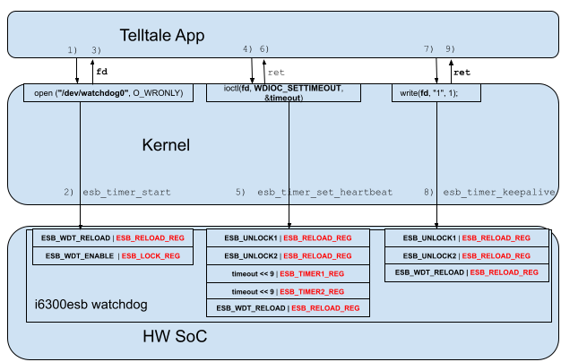
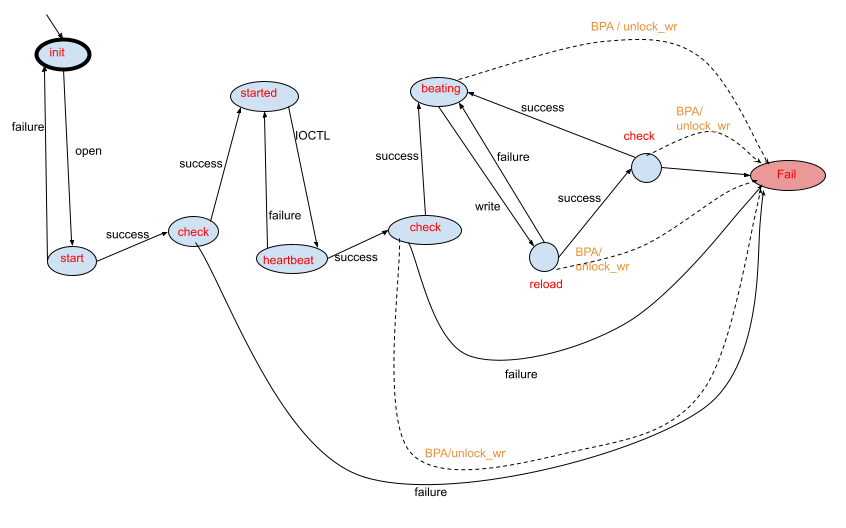
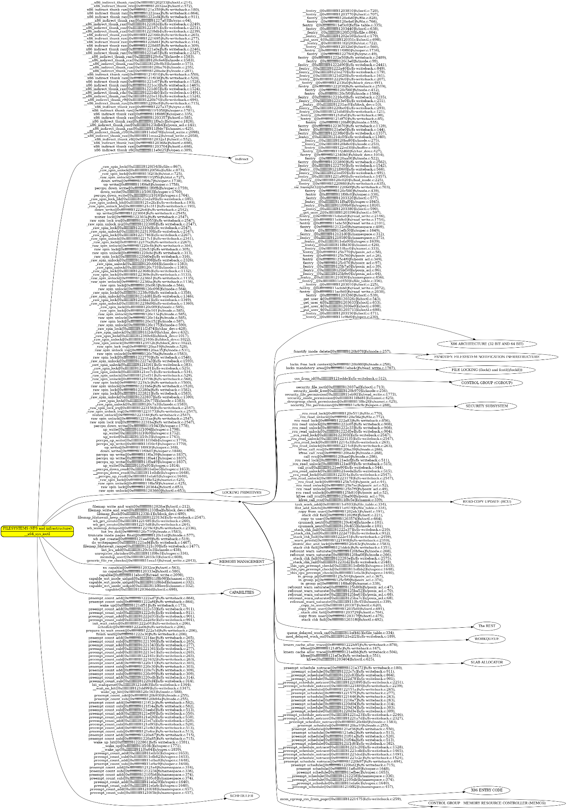

<!-----

You have some errors, warnings, or alerts. If you are using reckless mode, turn it off to see inline alerts.
* ERRORs: 0
* WARNINGs: 0
* ALERTS: 3

Conversion time: 2.555 seconds.

Using this Markdown file:

1. Paste this output into your source file.
2. See the notes and action items below regarding this conversion run.
3. Check the rendered output (headings, lists, code blocks, tables) for proper
   formatting and use a linkchecker before you publish this page.

Conversion notes:

* Docs to Markdown version 1.0β36
* Mon Jul 15 2024 06:18:09 GMT-0700 (PDT)
* Source doc: Kernel Safety Claims by Runtime Verification Monitors
* Tables are currently converted to HTML tables.
* This document has images: check for >>>>>  gd2md-html alert:  inline image link in generated source and store images to your server. NOTE: Images in exported zip file from Google Docs may not appear in  the same order as they do in your doc. Please check the images!

WARNING:
You have 8 H1 headings. You may want to use the "H1 -> H2" option to demote all headings by one level.

----->
# Kernel Safety Claims by Runtime Verification Monitors

# **Disclaimer**

This document only focuses on the qualification of the Kernel functionalities supporting the following requirements:

* KSR_0003: the watchdog subsystem shall ensure the opened WD device to be the one specified as input argument;
* KSR_0004: The watchdog subsystem shall ensure the WD timeout to be set according to the ioctl input parameter;
* KSR_0005: The operating system shall ensure the WD timeout to be not wrongly re-set to a different timeout value;
* KSR_0012: Writing the Watchdog shall reset it with a timeout equal to the one specified in the IOCTL. No other timeout value shall be used / reconfigured

All other Kernel Safety Requirements defined in [Telltale_Safe](https://docs.google.com/spreadsheets/d/1EbuVvhXo-xZc2aPTfMgQtPNPDQYtcozs/edit#gid=584539121) are not in the scope of this document. \
Therefore the solution proposed in this document **is NOT** sufficient to qualify the Kernel against all the allocated safety requirements; only a subset of them is covered.

# Introduction

The goal of this document is to define a comprehensive methodology to design an RV Monitor against a set of allocated safety requirements. \
Instead we do not intend to prove the RV Monitor to be able to accommodate every single use case.

### Why it is hard to qualify the Kernel to support associated safety claims

The Linux Kernel is monolithic and provides thousands of functionalities in order to support a huge amount of applications across multiple industry domains and across many different target HW platforms.

For this reason the Kernel is designed to be modular (see [MAINTAINERS](https://github.com/torvalds/linux/blob/master/MAINTAINERS)), however each Kernel element (subsystem or driver) provides many functionalities and all such elements can interact and interfere with each other in a very complex way. To understand how complex such interactions can be, fig. [1] in the Appendix shows the possible call tree in the context of ioctl between “FILESYSTEMS (VFS and infrastructure)” and the drivers or subsystems it communicates with. \
 \
As an example, if there is a safety requirement associated with ioctl() (e.g. ioctl shall be used to set the correct timeout in an external safety watchdog device), even if the operation is in principle very simple, the active Kernel code can be classified as follows: 

1. Kernel code that functionally contributes to the allocated safety requirement, since it has been designed to fulfill a specific purpose. E.g. a device driver that implements a functionality associated with a FuSa requirement.
2. Kernel code that incidentally contributes to the allocated safety requirement, since it has been designed to fulfill a system-level functionality that receives cascaded requirements from the code described in the previous point. E.g. scheduler, memory management, list primitives, locking primitives, etc.
3. Kernel code potentially invoked as part of the implementation but not functionally contributing to the safety requirement (e.g. printk).
4. Kernel code not invoked as part of the implementation nor incidentally contributing to the safety requirement, but that can interfere with it due to the monolithic nature of the Kernel

When it comes to claim that code as in 1, 2, 3 is correct and has no unintended functionalities, for a complex SW component, we need to hierarchically break it down into SW units; then for each of these we need to do a safety analysis and derive AoUs and Derived Safety Requirements; this regardless of the degree of functional contribution to the safety requirement. This process already proved to be very intensive even considering entire subsystems like single SW Units (e.g. [STPA(-like) inside the Kernel ](https://docs.google.com/document/u/0/d/1K_cQSS2KYDnJQ0B91Zvlxq9-35Cx8ntbXwVMQJ51rvY/edit)). \
Finally, with respect to interference failure modes from code classified as 4, as of today, there are no comprehensive architectural measures that can isolate code between different Kernel components.

### Which problems are solved by runtime verification monitors

[Runtime Verification Monitors](https://docs.kernel.org/trace/rv/index.html) are mechanisms inside the Kernel that allow monitoring the Kernel itself to behave according to a predefined machine state diagram. \
So if the Kernel misbehaves, the runtime verification monitor detects that the monitored Kernel code has violated the associated machine state diagram and accordingly raises an exception halting the execution or doing other custom remedial actions. \
In this regard RV Monitors could be used not only to do control flow monitoring but also data integrity monitoring. In fact it may be possible to associate states with corresponding constraints and conditions; data sets could be stored internally as part of the monitor specific data structures and, upon incoming events, it may be possible to check the correctness of the event specific data against the current state and associated data set.

So assuming that it is possible to prove FFI between RV Monitors and the rest of the Kernel code (see section below), adopting the RV Monitor solution would lead to the following advantages:

* The hierarchical safety analysis of the Kernel and associated safety requirements definitions can be limited to code functionally contributing to the allocated safety reqs (class A above).  
* The Runtime Verification Monitor provides an architectural protection mechanisms against Kernel interferences following a safety analysis of the resources to be monitored against interference failure modes  

### When is it valuable to use RV Monitors?

From a conceptual perspective the RV Monitors introduce redundancy inside the Kernel, it is therefore valuable to use them as qualification measure when the following criteria are met:

* The complexity of the Automata model is significantly lower than the code being monitored (i.e. when the code is capable of providing many functionalities under many different condition and states but only a specific subset of its potentials are used in a safety context); this implies that from a FuSa qualification effort perspective and continuous certification perspective dealing with a significantly smaller code baseline is cheaper and faster and hence it is better to make a systematic capability claim on the RV Monitor code instead of spending effort on proving the same for the monitored code.
* The expected behavior of the monitored code is comprehensively analyzed in how it would meet the allocated safety requirements. This is needed to guarantee that the monitor is monitoring all the critical states and data for safety reasons and to avoid the monitor triggering due to valid states and data not being analyzed. 
* The specific use case being evaluated is compatible with ex-post-facto treatment of the failure: by design the RVM will be able to detect the failure only after it has taken place and it cannot avoid it (it works as detection measure, not as prevention one). Therefore, for events associated with unrecoverable failures, the RVM cannot provide assurance on the availability of the monitored functionalities.
* It is possible to determine that the RVM shall always trigger before the detected failure propagates in a dangerous way to the safety workloads being monitored (avoid failure propagation)

# Integration of Runtime Verification Monitors with the Kernel

A monitor is the central part of the runtime verification of a system. The monitor stands in between the formal specification of the desired (or undesired) behavior, and the trace of the actual system.

In Linux terms, the runtime verification monitors are encapsulated inside the RV monitor abstraction. A RV monitor includes a reference model of the system or of a subset of the system (e.g. a model of a specific subsystem or of a device driver), a set of instances of the monitor defined at development time (e.g. per-cpu monitor, per-task monitor, and so on), and the helper functions that glue the monitor to the system. Depending on both the parameters being monitored and the specific hardware features available, different approaches can provide flexibility in managing the need of monitoring vs the overhead that it might introduce. More on this later.

Callbacks must be introduced in a way that is compatible with safety requirements allocated to the functionality they support.

Currently, the RV subsystem allows the usage of automata as formalism. The formalism uses **states** and **events** as entry points. Each time a callback is called, it produces an **event**, that is checked in the **current** **state**. The processing of the **event** and **state** results in the **next state**, which will be saved.

The state transition table used to define how the **current state** changes according to the possible **events** is a read only **matrix**. The current state is saved in a writable memory accessible in **kernel space**.

In addition to the verification and monitoring of the system, a monitor can react to an unexpected event. If an **event** is not valid for the **current state**, the automata will report an **unexpected event**. The forms of reaction can vary from logging the event occurrence to the enforcement of the correct behavior to the extreme action of taking a system down to avoid the propagation of a failure.

The [current state ](https://git.kernel.org/pub/scm/linux/kernel/git/bristot/linux.git/tree/include/linux/rv.h#n18)variable is stored in a regular memory space in the kernel. The place varies according to the **monitory type**. It can be either in a **global variable** for the global monitor, on a **per-cpu variable** on a per-cpu monitor, or data stored in the **task struct** for per task monitor.

The same consideration is true for the [monitoring](https://git.kernel.org/pub/scm/linux/kernel/git/bristot/linux.git/tree/include/linux/rv.h#n17) variable; such variable is used to activate or deactivate a specific instance of runtime verification monitor.

On top of such variables (that are defined as part of the da_monitor structure) it is possible to define any custom monitor specific data set that can be associated with the monitor states and be checked against event specific data to make sure the event itself is valid and the data set coming with it is also valid when compared against the current state specific data set.  

# Freedom From Interference between RV Monitors and the rest of Kernel code

From an interference perspective we have different types of interference:

* **Temporal**: Kernel code slowing down the monitor code so much to miss the associated FDTI deadline
* **Communication**: Kernel code interfering with the monitor code through the interfaces between the Kernel and the RV monitors
* **Spatial**: Kernel code interfering with the monitor code through random corruption of the Kernel address space

From a **temporal interference** point of view we can assume the safety relevant code (including the Kernel code) to be monitored by an external watchdog. So if such code slows down beyond the allocated max FDTI portion, the external watchdog will trigger. \
Now the monitored code by definition is safety relevant code, and, as explained above, the associated RV monitor executes sequentially in the same context of the code being monitored (since it is directly invoked by the trace interfaces added in the monitored code). \
So if the monitored code slows down, the RV Monitor code equally slows down and, as a result, the external watchdog is not pet on time, leading to a safe state driven physically by the watchdog.

Even in case of failure being detected by the RV Monitor, since the RV Monitor code executes synchronously with respect to the monitored code, if a fault reaction is not completed on time, in the end the external watchdog will trigger before the allocated max FDTI portion expires.

From a **communication** interference point of view, the only interfaces between the Kernel code and the RV monitors are the trace interfaces added by design in the code being monitored. So by design the lack of communication interference is guaranteed by the process that is followed to actually design the instances of RV Monitors (as further elaborated below).

More specifically, failures in the code being monitored leading to wrong data being passed to the trace interfaces should already be covered by the safety analysis that precedes the design of the specific RV Monitor instance covering such code.

From a **spatial interference** point of view there are different failures modes that we need to consider:

* **FM1:** the event or event specific data passed to the runtime verification monitor instance is corrupted by a spurious stack corruption \
**Effect of Failure**: the event corrupted could lead the RV monitor in a valid state that is not however the one of the code being monitored. \
**Prevention or detection measures:** The RV Monitor shall be designed to detect corruption of relevant DATA due to bugs in the code being monitored. \
Therefore there would be no difference, from a FuSa perspective, between a corruption of parameters due to a bug in the monitored Kernel code and a corruption of the same parameters due to random stack access from QM or NSR Kernel code. \
So by design the RV Monitor shall be able to detect such failure mode. \
 \
**Note**: a wrong parameter in the monitored code that turns to a valid one due to corruption on the stack is considered a double point of failure, hence not needed/ in scope.

* **FM2:** the current state or state specific data get corrupted on any writable memory region mapped in the Kernel address space due to random interference from Kernel code. \
**Effect of Failure**: the current state could switch to a wrong valid state or the state specific data could be dangerously change in a way that could lead the monitor to be ineffective. \
**Prevention or detection measures:** the current state and state specific data can be CRC protected before storing them, hence any random corruption would lead to a CRC check failure as the Monitor code is triggered by the next event (CRC could be replaced by less expensive integrity check algorithms if the targeted ASIL allows).
* **FM3**: RV Monitor code is corrupted due to random interference from Kernel code. \
**Effect of Failure**: RV Monitor code could not execute or wrongly execute leading to the monitor being ineffective. \
**Prevention or detection measures**: RV Monitor code is stored in memory mapped with the RO attribute, hence any spurious write would trigger an SMMU exception that would, at least, halt the execution of the Kernel, hence resulting in the external watchdog to trigger and drive the platform safe state

# RV Monitors Design

The Linux Kernel does not come with a SW Architecture documentation describing the interactions between the sub-elements of the Kernel or between the Kernel and the other HW/SW components it interfaces with (e.g. user space applications, Hypervisor, HW). \
 \
With respect to calls from user space applications to the Kernel, [syscalls](https://man7.org/linux/man-pages/man2/syscalls.2.html) represent the available and standardized interfaces that the Kernel provides.

With respect to interactions from the HW or Hipervisor to the Kernel, architecture specific exceptions are defined as well as platform specific interrupt handlers. 

With respect to interactions between sub-components of the Kernel, ks-nav can be used to highlight function calls between drivers/subsystems and eventually support the determination of the events associated with such calls.

Finally with respect to calls from the Kernel to the HW again [ks-nav](https://github.com/elisa-tech/ks-nav) could be used to highlight low level functions directly accessing HW registers.

## Proposed Methodology

From an analysis perspective we can proceed as follows:

1. Retrieve the best available design specification for the Kernel entry points (syscalls or IRQ/Exception handlers); in this case for open, ioctl, write.
2. Define an initial set of failure modes from such specifications with respect to the allocated safety requirement and see if there are CoUs that can help to avoid or detect them.
3. Using a hierarchical top down approach, for the target subsystem, leverage the expert judgment to define failure modes and associated RPN indexes deriving from:\
    a. Wrong input parameters (corrupted or outside allowed boundaries)\
    b. Internal logic failures\
    c. SW or HW resource management mishandling\
    d. Wrong or corrupted SW configuration parameters\
    e. Wrong or corrupted SW calibration parameters (runtime configuration parameters)\
    f. Failure modes of outbound SW interfaces (outbound API not behaving as expected)
4. Define the expected behavior in absence of failures and, accordingly, propose improvements of the specification documentation.
5. Define mitigation actions for the failure modes with RPN above threshold and re-evaluate the final RPN post mitigation 
6. Iteratively analyze branches with residual RPN above threshold

## TODO: &lt;from failure modes to automata finite state diagrams>

## TODO: &lt;from automata to RV monitor implementation>

### https://docs.kernel.org/trace/rv/deterministic_automata.html

# RV Monitors Examples

## i6300esb Watchdog timeout monitor

### Introduction and Requirements

The goal of this RV Monitor is to qualify the Kernel according to a subset of the safety requirements defined for the Telltale Safety Application in this [sheet](https://docs.google.com/spreadsheets/d/1EbuVvhXo-xZc2aPTfMgQtPNPDQYtcozs/edit#gid=584539121). More specifically:

* **KSR_0003**: the watchdog subsystem shall ensure the opened WD device to be the one specified as input argument
* **KSR_0004**: The watchdog subsystem shall ensure the WD timeout to be set according to the IOCTL input parameter
* **KSR_0005**: The operating system shall ensure the WD timeout to be not wrongly re-set to a different timeout value
* **KSR_0012**: Writing the Watchdog shall reset it with a timeout equal to the one specified in the IOCTL. No other timeout value shall be used / reconfigured

**Assumption:** it is assumed that any boot time operation has been successfully completed; we could consider the design of a RV Monitor for guarding against boot time misconfigurations as a follow-on activity

### Static and Dynamic Architecture

 \

 \
As a first step we consider only the architectural elements that are functionally supporting the implementation of the safety requirements mentioned above; interfering architectural elements will be added later in the picture. \
 \
In the use case under analysis, to start with, we can identify 3 main elements interacting with each other:

* The Safety Application
* The Linux Kernel
* The HW SoC that also includes a programmable i6300esb watchdog.

 \
Accordingly we have the following events that characterize the expected interactions in absence of failures.

1. The Safety Application invokes the open syscall passing the input path from the filesystem associated with the watchdog to be opened.
2. Based on the path passed from open, the Kernel:\
	a. Allocates a unique file descriptor (fd) associated with the such watchdog device,\
	b. Unlocks the watchdog registers for write access;\
	c. Reloads the external watchdog (stops any previous counting)\
	d. Starts the watchdog using the default timeout programmed at boot time;
3. In case of success the Kernel returns the allocated unique fd to the Safety Application
4. The safety application uses the returned fd to set a new watchdog timeout by invoking  `ioctl(fd, WDIOC_SETTIMEOUT, &timeout`); where:\
	a. fd is the watchdog file descriptor returned by open\
	b. `WDIOC_SETTIMEOUT `is the ioctl command that corresponds to the operation of setting a watchdog timeout\
	c. `&timeout `is the user space address of the variable containing the timeout value to be written to the watchdog
5. According to the fd passed by the Safety Application the Kernel:\
	a. Shift Left by 9 bits the timeout value;\
	b. Unlocks the watchdog registers for write access;\
	c. Write the shifted value to `ESB_TIMER1_REG;\
	d. Unlocks the watchdog registers for write access;\
	e. Write the same shifted value to `ESB_TIMER2_REG;\
	f. Unlocks the watchdog registers for write access;\
	g. Reloads the external watchdog (stops any previous counting)
6. If successful the Kernels returns 0 to the Safety Application, else -1 is returned.
7. The Telltale apps starts the safety operations; the watchdog is pet by writing to the i6300esb watchdog device
8. The Kernel unlocks the watchdog registers for write access and reloads the watchdog timer
9. The write operations returns a non negative number to the safety application

### Definition of the i6300esb RV Monitor

At this stage there are two possibilities:

1. A safety analysis is done on the Kernel behavior associated with the architecture described above and an initial RV Monitor design is conceptualized. Then both design and safety analysis are updated till all dangerous failure modes are under control.
2. An initial RV monitor is designed and a safety analysis is done to verify its effectiveness against failure modes of the Kernel. Then both design and safety analysis are updated till all dangerous failure modes are under control.

In the end from an end result point of view there is no difference between them. With respect to this specific example we’ll start with an initial RV Monitor design that will be later verified by safety analysis and possibly refined.

#### i6300esb RV Monitor Initial Safety Requirements

* **KSR_RVM_0003**: following a call to open() with the input path associated with the i6300 watchdog device, the RV Monitor shall trigger kernel panic if a valid fd is returned by open and the driver either misses to do any expected operation on the i6300esb HW or does it in the wrong order
* **KSR_RVM_0004**: following a call to ioctl with the same fd returned by open and with `WDIOC_SETTIMEOUT` as input cmd, the RV Monitor shall trigger panic if success is returned and the driver either misses to do any expected operation on the i6300esb HW or does it in the wrong order;
* **KSR_RVM_0005**: after a successful invocation of ioctl() the RV Monitor shall trigger Kernel Panic if the i6300esb HW registers to set the timeout value (ESB_TIMER1_REG, ESB_TIMER2_REG) are attempted to be written
* **KSR_RVM_0012**: after a successful invocation of ioctl() the RV Monitor shall trigger Kernel Panic if any thread different from the one associated with the Telltale Application unlock the write access to the watchdog registers
* **KSR_RVM_0012.1**: after a successful invocation of ioctl() the RV Monitor shall trigger Kernel Panic if the writes invoked from the Telltale Application returns success and the driver either misses to do any expected operation on the i6300esb HW or does it in the wrong order;
* **KSR_RVM_0012.2**: after a successful invocation of ioctl() the RV Monitor shall trigger Kernel Panic if any write is attempted to ESB_LOCK_REG

#### i6300esb RV Monitor Initial Design

  

The RV Monitor is modeled by the automata diagram pictured above. Each circle represents a state of the RV monitor (monitoring the whole Kernel in this case), each arrow represents an event that leads to a state transition. \
 \

<table>
  <tr>
   <td><strong>State</strong>
   </td>
   <td><strong>State Description</strong>
   </td>
   <td><strong>Possible Events</strong>
   </td>
   <td><strong>Next State</strong>
   </td>
  </tr>
  <tr>
   <td>init
   </td>
   <td>This is the initial state following the system boot up
   </td>
   <td>open: the open syscall has been invoked passing the FS path associated with the i6300 watchdog device 
   </td>
   <td>start
   </td>
  </tr>
  <tr>
   <td rowspan="2" >start
   </td>
   <td rowspan="2" >open has been invoked and accordingly the i6300 watchdog is enabled and starts ticking according to the default timeout
   </td>
   <td>failure: something went wrong enabling or starting the i6300 watchdog
   </td>
   <td>init
   </td>
  </tr>
  <tr>
   <td>success: Open is going to return a valid file descriptor 
   </td>
   <td>start_check
   </td>
  </tr>
  <tr>
   <td rowspan="2" >start_check
   </td>
   <td rowspan="2" >Before open returns success, the RV monitor checks if the operations on the HW have been performed as expected 
   </td>
   <td>success: the operations on the HW have been performed as expected
   </td>
   <td>started
   </td>
  </tr>
  <tr>
   <td>failure: open was going to return success while one or more operations on the HW were not as expected   
   </td>
   <td>Fail
   </td>
  </tr>
  <tr>
   <td>started
   </td>
   <td>the i6300 watchdog is enabled and is ticking according to the default timeout, the corresponding file descriptor has also been returned to the safety application
   </td>
   <td>ioctl: the ioctl syscall has been invoked on the i6300 file descriptor with the command <code>WDIOC_SETTIMEOUT</code> and a timeout value  
   </td>
   <td>heartbeat
   </td>
  </tr>
  <tr>
   <td rowspan="2" >heartbeat
   </td>
   <td rowspan="2" >ioctl has been invoked and the i6300 watchdog timer registers are programmed according to the timeout value passed by the safety app. Also the watchdog starts ticking 
   </td>
   <td>failure: something went wrong with the ioctl operation 
   </td>
   <td>started
   </td>
  </tr>
  <tr>
   <td>success: the ioctl operation succeeded and ioctl is going to return success to the safety app
   </td>
   <td>heartbeat_check
   </td>
  </tr>
  <tr>
   <td rowspan="3" >heartbeat_check
   </td>
   <td rowspan="3" >Before ioctl returns success, the RV monitor checks if the operations on the HW have been performed as expected 
   </td>
   <td>success: the operations on the HW have been performed as expected
   </td>
   <td>beating
   </td>
  </tr>
  <tr>
   <td>failure: ioctl was going to return success while one or more operations on the HW were not as expected   
   </td>
   <td>Fail
   </td>
  </tr>
  <tr>
   <td>BPA / unlock_wr: the watchdog timer registers were attempted to be written or a thread different from the safety app tried to unlock the i6300 HW for write access
   </td>
   <td>Fail
   </td>
  </tr>
  <tr>
   <td rowspan="2" >beating
   </td>
   <td rowspan="2" >The ioctl returned success and the i6300 watchdog is ticking according to the programmed timeout
   </td>
   <td>write: the Safety App invoked a write syscall on the i6300 file descriptor
   </td>
   <td>reload
   </td>
  </tr>
  <tr>
   <td>BPA / unlock_wr: the watchdog timer registers were attempted to be written or a thread different from the safety app tried to unlock the i6300 HW for write access
   </td>
   <td>Fail
   </td>
  </tr>
  <tr>
   <td rowspan="3" >reload
   </td>
   <td rowspan="3" >The watchdog is reloaded according to the current timeout and starts ticking
   </td>
   <td>failure: something went wrong when reloading the watchdog
   </td>
   <td>beating
   </td>
  </tr>
  <tr>
   <td>success: the reload operation succeeds and write is going to return success
   </td>
   <td>reload_check
   </td>
  </tr>
  <tr>
   <td>BPA / unlock_wr: the watchdog timer registers were attempted to be written or a thread different from the safety app tried to unlock the i6300 HW for write access
   </td>
   <td>Fail
   </td>
  </tr>
  <tr>
   <td rowspan="3" >reload_check
   </td>
   <td rowspan="3" >Before write returns success, the RV monitor checks if the operations on the HW have been performed as expected 
   </td>
   <td>success: the operations on the HW have been performed as expected
   </td>
   <td>beating
   </td>
  </tr>
  <tr>
   <td>failure: write was going to return success while one or more operations on the HW were not as expected   
   </td>
   <td>Fail
   </td>
  </tr>
  <tr>
   <td>BPA / unlock_wr: the watchdog timer registers were attempted to be written or a thread different from the safety app tried to unlock the i6300 HW for write access
   </td>
   <td>Fail
   </td>
  </tr>
  <tr>
   <td>fail
   </td>
   <td>The monitored code is in an invalid state, hence the RV Monitor triggers Kernel Panic here 
   </td>
   <td>None
   </td>
   <td>
   </td>
  </tr>
</table>

## i6300esb RV Monitor Associated Safety Analysis

The safety analysis aimed to verify the effectiveness of the i6300esb RV Monitor to qualify the whole Kernel for the use case described above is conducted according to the proposed methodology presented above. Hence the following steps are followed:

1. Retrieve the best available design specification for the Kernel entry points (syscalls or IRQ/Exception handlers);

For this specific use case the relevant, initial, entry points are open(), ioctl(), write(). The initial relevant specifications to be considered are the Linux [manpage](https://git.kernel.org/pub/scm/docs/man-pages/man-pages.git/) (TODO: since the manpage is not part of the Kernel source tree, it is not clear which version map to which Kernel release, plus the manpage also covers the glibc…), therefore [open](https://man7.org/linux/man-pages/man2/open.2.html), [ioctl](https://man7.org/linux/man-pages/man2/ioctl.2.html), [write](https://man7.org/linux/man-pages/man2/write.2.html).

In the Linux manpage there is a “STANDARD” section that states which APIs covered by the manpage are compliant with any international standard and declares any known deviation. For the syscalls under analysis both open and write are claimed to be POSIX.1-2008 compliant while, apparently ioctl is not compliant with any standard (TODO: to understand if ioctl not claimed posix compliant is a bug or there is a reason). \
Therefore also the posix specifications for [open](https://pubs.opengroup.org/onlinepubs/9699919799.2008edition/functions/open.html) and [write](https://pubs.opengroup.org/onlinepubs/9699919799.2008edition/utilities/write.html) can be used to complement the manpages (TODO: the latest Posix specs are 2017…so check why manpages claim compliance with Posix 2008 and not 2017…). \
By reading the Linux manpages and the Posix specifications for open() and write() it is not clear that, for device files, the Linux behavior is implementation specific (actually device driver specific), this is instead better clarified for ioctl (TODO: investigate how to patch the manpages to clarify the device-specific behavior for open and write). \
In the use case under analysis such syscalls operate on the i6300esb watchdog; so the relevant additional documentation for the Kernel source tree can be found in the “[Watchdog Support](https://docs.kernel.org/watchdog/index.html)” section. This section is further divided into multiple files:

* [HPE iLO NMI Watchdog Driver](https://docs.kernel.org/watchdog/hpwdt.html)
* [Mellanox watchdog drivers](https://docs.kernel.org/watchdog/mlx-wdt.html)
* [Berkshire Products PC Watchdog Card](https://docs.kernel.org/watchdog/pcwd-watchdog.html)

These 3 files above are not relevant to our use case since they provide specific information for other watchdog devices

* [The Linux Watchdog driver API](https://docs.kernel.org/watchdog/watchdog-api.html)

This document describes the behavior of the common watchdog driver framework in response to the file operations invoked from user space. As of today however only part of ioctl behavior is documented, whereas open and write do not appear. \
[TODO: propose patches to extend this doc file to the rest of the allowed file operations]

* [The Linux WatchDog Timer Driver Core kernel API](https://docs.kernel.org/watchdog/watchdog-kernel-api.html)

This file describes the behavior of the common watchdog driver framework defined operations and the meaning of the watchdog device structure members,  however we miss how these operations and members are linked to the file operations associated with the watchdog driver \
[TODO: propose patches to extend this doc to link the watchdog functionalities and parameters with the watchdog driver file operations]

* [WatchDog Module Parameters](https://docs.kernel.org/watchdog/watchdog-parameters.html)

This is the list of allowed configuration parameters on a per-watchdog basis. Here we can find those applicable to the i6300esb specific watchdog

* [The Linux WatchDog Timer Power Management Guide](https://docs.kernel.org/watchdog/watchdog-pm.html)

This file “should” cover power management, however it just provide a couple of link to some patches….regardless it is not applicable to our use case

* [WDT Watchdog Timer Interfaces For The Linux Operating System](https://docs.kernel.org/watchdog/wdt.html)

This file is not relevant for our use case, since it covers the interfaces of the Linux timer specific watchdog

* [Converting old watchdog drivers to the watchdog framework](https://docs.kernel.org/watchdog/convert_drivers_to_kernel_api.html)

This file is aimed at Kernel developers wishing to convert legacy watchdogs into newer ones compatible with the latest watchdog framework. So this is not applicable to us.

There is not platform driver documentation specific of the i6300esb watchdog \
[TODO: put together i6300esb specific doc]

2. Using a hierarchical top down approach, for the target SW component, leverage the expert judgment to define failure modes and associated RPN indexes deriving from:
    1. Wrong input parameters (corrupted or outside allowed boundaries) 
    2. Internal logic failures
    3. SW or HW resource management mishandling
    4. Wrong or corrupted SW configuration parameters
    5. Wrong or corrupted SW calibration parameters (runtime configuration parameters)
    6. Failure modes of outbound SW interfaces (outbound API not behaving as expected)

    The reason for a hierarchical FMEA is to extend the FMEA beyond the scope of failures originating in the target SW component to evaluate the impact from failures originating in dependent SW/HW components.

3. Define the expected behavior in absence of failures and, accordingly, propose improvements of the specification documentation. \
The reason for such phase is to enforce the functional expert supporting the failure mode definition to describe the correct design behavior and accordingly fill the documentation gap (so that it is also possible to drive the verification and test campaign)
4. Define mitigation actions for the failure modes with RPN above threshold and re-evaluate the final RPN post mitigation  \

5. Iteratively analyze dependent SW/HW elements where a systematic capability claim is required.

The resulting safety analysis has been performed [here](https://docs.google.com/spreadsheets/d/1bfherKHhuL4XgfmvmShAQwLNn74WbvrW67WRS30qc8U/edit?usp=sharing) [TODO replace the GDoc analysis with one in github once it has been pushed]

# Limitations and Improvements

## Quality and Availability

By using runtime verification monitors to make safety claims we do not have any advantage in terms of quality of the monitored code. \
This implies that monitored code coming with low quality would directly impact availability requirements (e.g. by the RV Monitor continuously triggering a safe state).

## Tracepoints

Relying on runtime tracepoints implies allocating safety requirements to a mechanism that is more complex than relying on compile time resolution of monitoring points hooks; therefore it may be preferable to use compile time ones. However each user can make his own analysis in this regard.

## Monitored Data access

**TODO**: evaluate if, for failure avoidance purposes and hence availability purposes, it is doable to directly read the data to be monitored from the monitored code heap or stack instead of passing it as parameters on the stack. The rationale is that passing critical data through function parameters would increase the surface of possible corruption.

Taking for example an "int" variable, passing it as parameter, either by value or by reference, creates an additional step that is susceptible to interference at runtime.  Using an external reference in the sources + direct read access from the monitoring function, would generate a reference encoded within the executable memory, and thus impervious to accidental overwrites.

## Temporal FFI assumption

If it is not possible to guarantee the assumption of “the safety relevant code (including the Kernel code) to be monitored by an external watchdog”, then the FFI temporal interference concept above must be revisited.

## How to effectively protect HW or SW resources corruptible from any Kernel code of lower systematic capability

The monitored subsystem is characterized by different operating states where for one or more of such states the correct operation of the system depends on the correct configuration of certain HW or SW resources. \
Fow such HW or SW resources that are accessible by Kernel code, we should figure out a way to avoid or detect spatial interference.

The interference can manifest itself in different ways:

* The most obvious is as a direct write operation that affects a memory address region consisting of one or more addresses.
    * In some cases the addresses may refer to actual physical memory.

        Here, the interference can alter in an unsafe way the content of the affected memory locations.

    * In other cases the addresses may refer to a peripheral device.

        In modern systems the address space used for memory is also used for interacting with certain peripherals (memory mapped I/O), where at certain addresses specified by the processor hardware datasheet it is possible to access both configuration registers and I/O registers of said peripherals.

        The effect of the interference is not easy to generalise, because it strongly depends on which type of peripheral and registers are involved and what values might be written there.

    * Especially on 64 bit systems which are capable of addressing a very large address space, it is also possible that nothing is associated with a specific address; in such a case, a write operation will fail with a bus error and it will trigger an exception. This scenario can be considered as safe, because the exception will be noticed by the system and it can be acted upon (usually an MMU translation error). \
Note: care shall be taken about drivers being capable of disabling exceptions and accordingly a safety analysis shall be performed to make sure such scenarios are either avoided or handled in a safe way.  \

* Certain peripherals that are more intertwined with the basic core within the processor are not memory mapped using the memory bus, but have a separate access mechanism. On an ARM core, for example, they are called coprocessors, and the way the ARM core interacts with them is through specific coprocessor read and write assembly instructions.

    Coprocessors are referred to by specific coprocessors IDs: each coprocessor has a reserved ID value and such ID is fixed across the entire architecture, no matter the specific SoC design. 

    Because the access happens through a specific coprocessor read/write instruction, followed by the coprocessor ID and then coprocessors specific parameters, coprocessors are not exposed to the interference through spurious write operations, however they are still subject to indirect interference, for example through a coprocessor write operation that either uses a wrong value, or is performed at the wrong time, as effect of some other interference.

In the Watchdog example shown above HW breakpoints are used to raise a breakpoint exceptions in case of such unintended writes happen; however HW breakpoints are quite limited in number (in the order of magnitude of tens) and therefore they may not be able to accommodate use case where the number of resources to be monitored is significantly high.

Different approaches to be further investigated are listed down below:

1. Implement a periodic checker that reads back critical SW and HW resources. This measure is only able to detect a corruption failure after it happens and it should be designed so that the max time between the resource corruption and its propagation to the system safety output is less than the allocated FDTI; hence the read-back period must be designed accordingly. \
 \
NOTE: this mechanism is not effective against corruption of write-only resources (since by definition these cannot be read-back). \

2. sanitize and emulate the write operation(s):
    * This approach requires a HW-backed mechanism that can validate the operation and execute it from a context with same or higher safety level than the one required
        * Option 1: introduce explicit invocation - for example through hypervisor or secure mode call - of the safer context, and prevent direct access from the kernel. \
 \
NOTE: for pre-existing Kernel Drivers/Subsystems this option requires a re-design of part of the Driver/Subsystem (the low-level access part) \

        * Option 2: silently trap the operation (still through hypervisor or secure monitor), validate it and perform it, if legal, otherwise raise an event with the system level safety monitor (whatever that might be) \
 \
Note: depending on the HW platform and/or the hypervisor the trapping mechanism could work on the single HW registers or on entire memory pages. For peripherals registers most likely the trapping happens on entire memory pages dedicated to I/O memory. \
For entire memory pages there is a risk of performance hit depending on the specific use cases. \
For HW registers we also need to pay attention to registers used to invoke instruction and pass data to dedicated co-processors
    * Depending on what needs to be protected and the mechanism chosen, it might be possible to be selective (e.g. trap write operations to single registers or to specific peripherals), or it might be necessary to trap write operations to entire address ranges.
    * Depending on specific HW, trapping and emulating write operations to large address ranges might be too prohibitive, because the peripheral that needs protection might happen to have its registers interleaved with registers of another peripheral that does not require write protection AND is written to very often.
    * The approach chosen depends heavily on the specific HW at hand and he possibility to affect its memory mapping, so that it is friendly toward this sort of safety mechanism
    * For dedicated coprocessors used for ASIL operations, these might be accessed through dedicated instructions, rather than generic memory write operations. In these cases usually a spurious write corruption from unintended code is unlikely given the way the write accesses are specified.~~ \
~~On the other hand, trapping and emulating the coprocessor write instruction would ensure that each and every attempt to alter the state of any coprocessor would be caught. Such emulation can intercept coprocessor write operations and, for each coprocessor, have a separate state machine, to validate the attempted write operation. Whether trapping is required or not must be evaluated on a case by case basis. \
 \

    * **TODO**: Idea3 could be to unmap the critical HW resources from the Kernel address space and hook RV Monitor code into the exception handler 

# Appendix

 \
[1] - ioctl() call tree of “FILESYSTEMS (VFS and infrastructure)”

